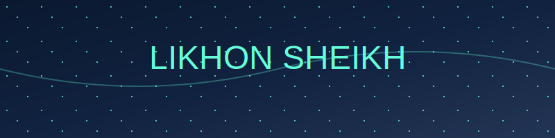
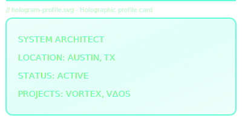
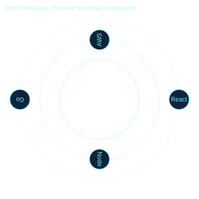
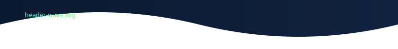
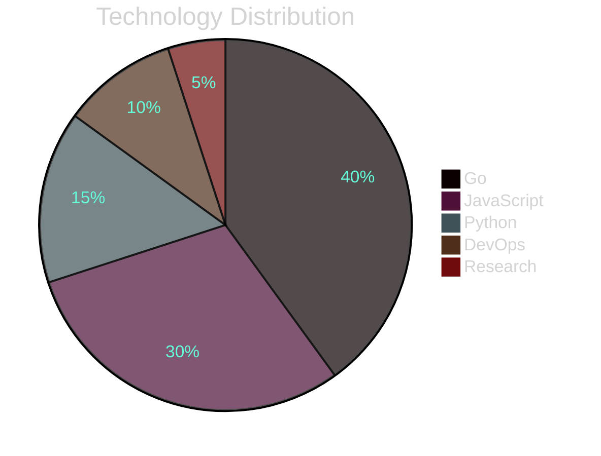

<!-- // cosmic-header.svg - Main banner animation -->
<div align="center">
  


[](https://likhonsheikh.com)
[](https://goo.gl/maps/Austin)

</div>

<!-- // hologram-profile.svg - Interactive profile card -->
<div align="center">
  


</div>

## ⚡ Tech Universe

<!-- // tech-orbital.svg - Dynamic tech visualization -->
<div align="center">
  


```javascript
const techStack = {
  languages: ['JavaScript', 'Go', 'Python', 'TypeScript'],
  frameworks: ['React', 'Node.js', 'Express', 'Next.js'],
  cloud: ['AWS', 'GCP', 'Cloudflare'],
  tools: ['Docker', 'Kubernetes', 'Terraform'],
  databases: ['PostgreSQL', 'MongoDB', 'Redis']
};
```

</div>

## 📊 Matrix Analytics

<!-- // matrix-stats.svg - Animated statistics -->
<div align="center">
  


</div>

## 🚀 Active Projects

<!-- Project cards with wave animation -->
<table>
<tr>
<td width="50%">

### 🌌 VorTex Engine

```python
class VorTex:
    """High-performance computing engine"""
    status = "Production"
    tech = ["Go", "CUDA", "React"]
    scale = "Global"
```

</td>
<td width="50%">

### 🌊 VΔOS Platform

```javascript
const VΔOS = {
  type: "CDN Platform",
  status: "Beta",
  stack: ["Node.js", "Cloudflare", "K8s"],
  reach: "Worldwide"
};
```

</td>
</tr>
</table>

## 💫 Weekly Coding Flow



## 🌐 Digital Cosmos

<div align="center">

[](https://likhonsheikh.com)
[](https://github.com/likhonsheikh54)
[](https://linkedin.com/in/likhonsheikh)

</div>

<!-- Animated contribution stats -->
```javascript
const contributions = {
  code: "1.2k commits",
  projects: "15 repositories",
  reviews: "200+ pull requests",
  community: "Active mentor"
};
```

---

<div align="center">

*"Creating digital experiences that transcend ordinary boundaries"*


</div>

<!-- SVG Documentation -->
<!--
SVG Components Used:
1. cosmic-header.svg - Animated cosmic wave banner with floating effects
2. hologram-profile.svg - Interactive holographic profile card
3. tech-orbital.svg - Dynamic tech stack visualization with orbital animations
4. matrix-stats.svg - Matrix-inspired statistics display
5. header-wave.svg - Decorative wave animations for sections
-->
